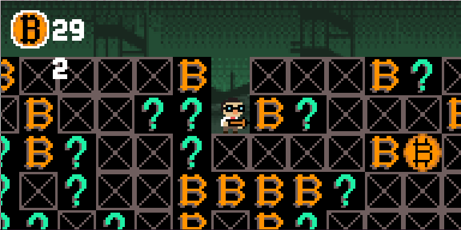
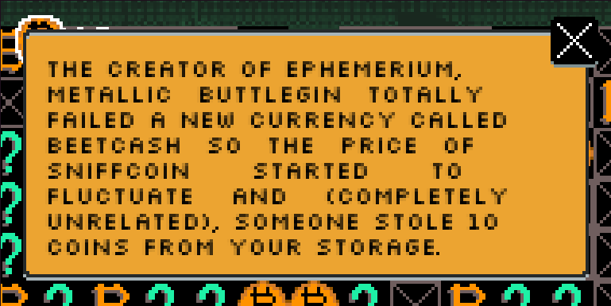

# Cryptodigger

Classic mining game with cryptocurrency thematics and random events,
that are inspired by Twitter-based cryptoeconomics and represented 
as collectible cards.




### Running

Make sure you have Golang tools installed. 
When you do, get the game with

```bash
go get github.com/rodentrabies/cryptodigger
```

and run it with

```bash
cd $GOPATH/src/github.com/mrwhythat/cryptodigger
go run *.go
```


### Controls

| Key                                  | Action                               |
|--------------------------------------|--------------------------------------|
| <kbd>a</kbd>                         | go left                              |
| <kbd>d</kbd>                         | go right                             |
| <kbd>a</kbd> + <kbd>LeftMouse</kbd>  | dig block to the left of you         |
| <kbd>d</kbd> + <kbd>LeftMouse</kbd>  | dig block in the right of you        |
| <kbd>s</kbd> + <kbd>LeftMouse</kbd>  | dig block in below you               |
| <kbd>LeftMouse</kbd>                 | press button, if it is on the screen |
